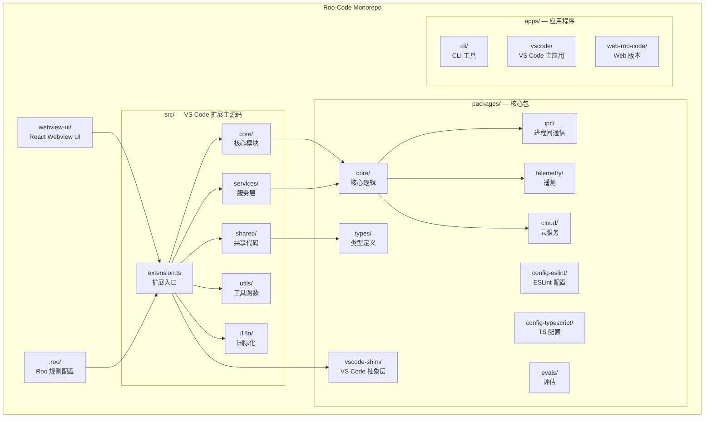
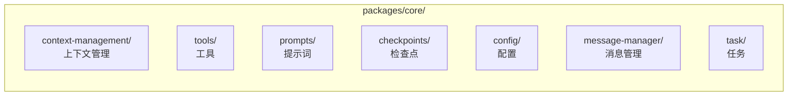
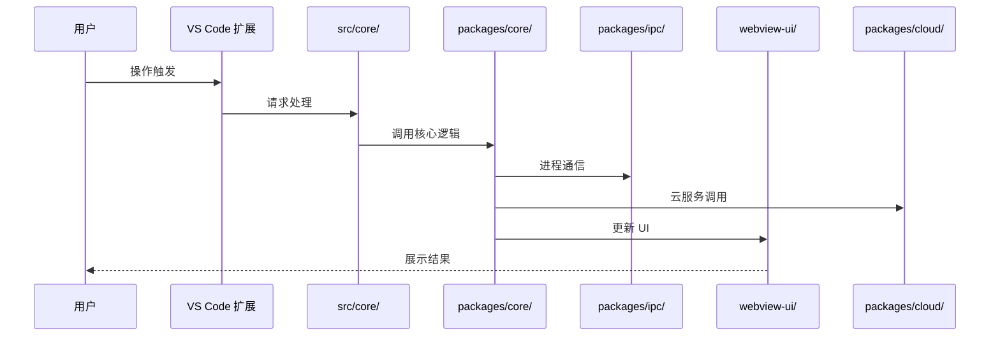

# Roo-Code 架构文档

## 项目概览

Roo-Code 是一个基于 TypeScript 的 Monorepo 项目，使用 Turborepo 进行构建管理。项目主要由 VS Code 扩展组成，同时包含 CLI 工具和 Web 版本。

- **项目类型**：TypeScript Monorepo
- **构建工具**：Turborepo
- **包管理器**：pnpm
- **许可证**：Apache 2.0
- **源码目录**：`/home/hermes/opensource/Roo-Code`

---

## 整体架构图



---

## Monorepo 目录结构

```
Roo-Code/
├── src/                    # 主扩展源码
│   ├── core/               # 核心模块
│   ├── extension.ts        # VS Code 扩展入口
│   ├── services/           # 服务层
│   ├── shared/             # 共享代码
│   ├── utils/              # 工具函数
│   └── i18n/               # 国际化
├── packages/               # 核心包
│   ├── core/               # 核心逻辑
│   ├── ipc/                # 进程间通信
│   ├── telemetry/          # 遥测
│   ├── vscode-shim/        # VS Code 抽象层
│   ├── cloud/              # 云服务
│   ├── config-eslint/      # ESLint 配置
│   ├── config-typescript/  # TS 配置
│   ├── types/              # 类型定义
│   └── evals/              # 评估
├── apps/                   # 应用
│   ├── cli/                # CLI 工具
│   ├── vscode/             # VS Code 主应用
│   └── web-roo-code/       # Web 版本
├── webview-ui/             # Webview React UI
└── .roo/                   # Roo 规则（XML 配置）
```

---

## 核心模块详解

### src/core/ 核心模块

`src/core/` 包含扩展的核心功能模块：

| 模块 | 说明 |
|------|------|
| `assistant-message/` | 助手消息处理 |
| `auto-approval/` | 自动审批逻辑 |
| `checkpoints/` | 检查点管理 |
| `config/` | 配置管理 |
| `context/` | 上下文管理 |
| `context-management/` | 上下文生命周期管理 |
| `message-manager/` | 消息管理 |
| `task/` | 任务管理 |
| `tools/` | 工具注册与执行 |
| `prompts/` | 提示词管理 |
| `diff/` | 差异比较 |

### packages/core/ 核心逻辑包

`packages/core/` 是独立的核心逻辑包，被主扩展和其他应用共享：



---

## 进程间通信（IPC）

`packages/ipc/` 负责各进程之间的通信，支持：

- 主进程与渲染进程的通信
- VS Code 扩展与 CLI 工具间的通信
- 跨窗口/跨标签页的消息传递

---

## VS Code 抽象层（vscode-shim）

`packages/vscode-shim/` 提供了 VS Code API 的抽象层，使得核心逻辑可以在非 VS Code 环境中运行（如 Web 版本），主要抽象：

- 编辑器操作
- 文件系统访问
- 通知与 UI 交互
- 工作区管理

---

## 数据流架构



---

## 技术栈

| 层级 | 技术 |
|------|------|
| 语言 | TypeScript |
| 构建工具 | Turborepo |
| 包管理器 | pnpm |
| 扩展框架 | VS Code Extension API |
| UI 框架 | React（webview-ui） |
| 通信协议 | IPC |
